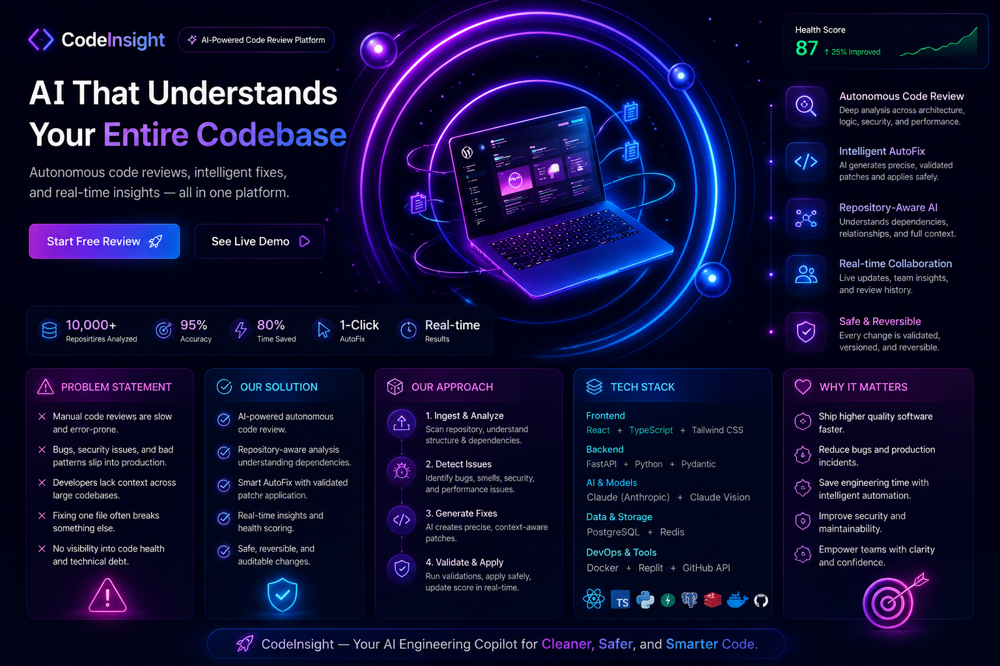

<p align="center">
  
</p>

<h1 align="center">🚀 CodeInsight</h1>

<h3 align="center">
Let your mind breathe, we handle the bugs.
</h3>

<p align="center">
  <b>Repository-Aware Autonomous AI Code Review & AutoFix Platform</b>
</p>
🚀 Live Demo

🔗 https://code-insight--lazykoala151515.replit.app
---

# 🧠 About CodeInsight

CodeInsight is an advanced AI-powered engineering platform designed to analyze, understand, validate, and improve entire software repositories — not just isolated files.

Unlike traditional code review tools, CodeInsight understands:

- repository architecture
- dependency relationships
- cross-file impact
- system design patterns
- security vulnerabilities
- validation safety

It behaves like:

> 🔥 An AI senior engineer embedded directly into your codebase.

---

# ✨ Core Vision

Modern development teams spend countless hours:

- debugging repetitive issues
- manually reviewing pull requests
- tracing dependency failures
- fixing architecture problems
- resolving production regressions

CodeInsight changes that by combining:

✅ AI reasoning  
✅ repository intelligence  
✅ dependency-aware analysis  
✅ safe autofix pipelines  
✅ realtime engineering assistance  

---

# 🌌 Why CodeInsight?

Traditional AI coding tools:

❌ analyze isolated files  
❌ generate unsafe fixes  
❌ ignore architecture dependencies  
❌ hallucinate solutions  
❌ break existing systems  

CodeInsight:

✅ understands entire repositories  
✅ validates fixes safely  
✅ analyzes dependency impact  
✅ maintains rollback safety  
✅ behaves like a senior engineer  

---

# ⚡ Key Features

## 🧠 Repository-Wide AI Analysis

CodeInsight analyzes:

- entire repositories
- architecture structure
- dependency graphs
- framework patterns
- security risks
- code smells
- performance bottlenecks

NOT just individual files.

---

## 🔗 Dependency-Aware Intelligence

Fixes are NOT generated blindly.

The system understands:

```txt
File A → affects → File B → affects → File C
```

Before applying any patch, CodeInsight:

- maps dependencies
- analyzes imports
- validates references
- checks cross-file impact

---

## 🤖 Autonomous AI Taskbar Assistant

An intelligent floating AI engineering assistant available throughout the platform.

Supports:

- 💬 text prompts
- 🎤 voice prompts
- 🖼 screenshot uploads
- 📄 error log uploads
- 🧠 architecture-aware debugging

---

## ⚙️ Intelligent AutoFix Engine

CodeInsight can:

- generate validated patches
- apply fixes safely
- show before/after diffs
- update repository health score
- rollback changes instantly

---

## 🛡️ Safe Validation Pipeline

Every fix goes through:

✅ syntax validation  
✅ dependency validation  
✅ import resolution  
✅ lint checks  
✅ cross-file consistency checks  
✅ optional test simulation  

---

## 📊 Health Score Engine

Track repository quality in realtime.

Metrics include:

- maintainability
- security
- architecture quality
- duplication
- complexity

---

# 🏗️ System Architecture

```txt
Repository Upload
        ↓
Repository Analysis
        ↓
Dependency Mapping
        ↓
AI Review Engine
        ↓
Issue Detection
        ↓
Patch Generation
        ↓
Validation Engine
        ↓
Safe Autofix
        ↓
Realtime Dashboard Update
```

---

# 🧩 Tech Stack

## 🎨 Frontend

- React
- TypeScript
- Tailwind CSS
- Framer Motion

---

## ⚙️ Backend

- FastAPI
- Python
- Pydantic
- WebSockets

---

## 🧠 AI Models

- Claude Sonnet
- Claude Vision
- GPT-4.1 *(future-ready support)*

---

## 🗄️ Database & Retrieval

- PostgreSQL
- Redis
- pgvector *(planned)*

---

## 🔍 Repository Intelligence

- AST Parsing
- Dependency Graph Analysis
- Semantic Context Retrieval

---

## ☁️ Infrastructure

- Replit
- GitHub API
- Docker

---

# 🚀 Core Modules

| Module | Description |
|---|---|
| Repository Analyzer | Understands full repository structure |
| Dependency Engine | Maps imports + relationships |
| AI Taskbar | Context-aware engineering assistant |
| AutoFix Engine | Generates validated patches |
| Validation Engine | Prevents unsafe fixes |
| Rollback System | Safe patch reversion |
| Health Score System | Measures code quality |
| Review Dashboard | Displays issues + diffs |

---

# 🔥 Example Workflow

## User uploads repository

CodeInsight:

- scans architecture
- builds dependency graph
- detects issues

---

## User asks Taskbar

```txt
Why is OAuth authentication failing?
```

The AI:

- retrieves auth-related files
- loads dependency context
- analyzes issue history
- generates contextualized fix

---

## User clicks “Apply Fix”

CodeInsight:

- validates patch
- checks imports
- applies safely
- updates health score
- enables rollback

---

# 📌 Current MVP Capabilities

✅ Repository issue analysis  
✅ Dependency-aware review  
✅ AI taskbar assistant  
✅ Patch generation  
✅ Safe autofix flow  
✅ Revert functionality  
✅ Screenshot debugging  
✅ Voice input support  
✅ Realtime dashboard updates  

---

# 🚀 Future Roadmap

- GitHub PR automation
- Full repository cloning
- Multi-agent workflows
- CI/CD integration
- Enterprise collaboration
- Multi-language AST support
- AI memory system
- Full vector retrieval pipeline

---

# 🛡️ Engineering Principles

CodeInsight prioritizes:

✔ correctness  
✔ safety  
✔ explainability  
✔ traceability  
✔ validation  
✔ architecture awareness  

---

# 🌌 Final Mission

CodeInsight is not just a code review tool.

It is:

> ⚡ An AI Engineering Operating System

Designed to help developers:

- think less about repetitive debugging
- move faster
- write safer systems
- build confidently

---

# ❤️ Built For Developers

<h3 align="center">
“Let your mind breathe, we handle the bugs.”
</h3>
